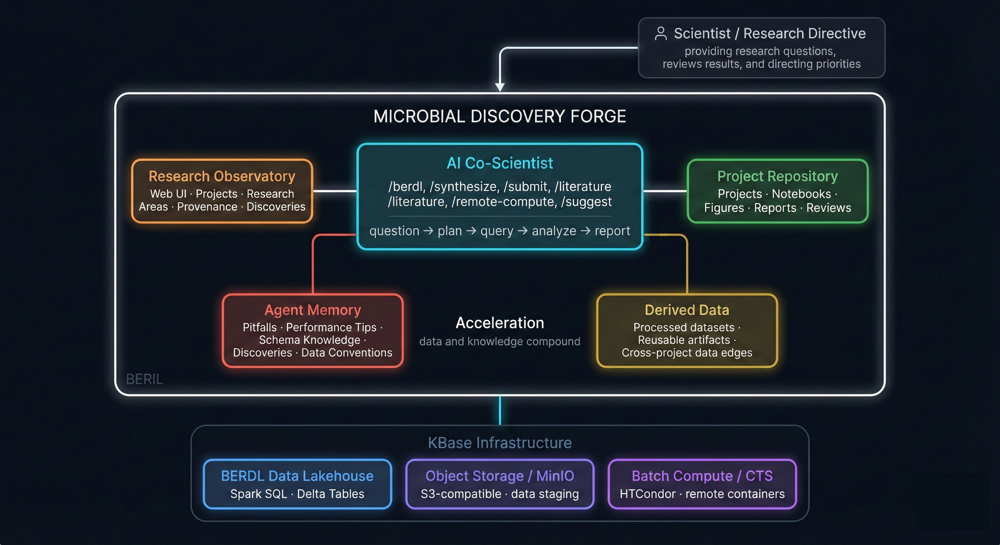

# Microbial Discovery Forge



The **Microbial Discovery Forge** is an AI co-scientist and research observatory, enabling researchers to interface with large-scale biological data through natural language, reusable skills, and shared knowledge.  You can browse the Forge through the [Observatory UI](https://beril.kbase.us/), or engage with it through an AI agent.

Currently, it connects to the KBase BER Data Lakehouse (K-BERDL), a curated Iceberg Lakehouse spanning pangenomics, fitness, biochemistry, metagenomics, and more.

Through the Microbial Discovery Forge, users can:

- **Analyze BERDL data** using AI-assisted workflows and documented patterns
- **Analyze their own data** in the context of BERDL reference collections
- **Share discoveries**, lessons learned, pitfalls, and data products
- **Explore multiple collections** across the data lakehouse
- **Contribute** to a growing BERIL Atlas with proper attribution

## What is BERDL?

The **KBase BER Data Lakehouse (K-BERDL)** is an Iceberg Lakehouse containing curated scientific datasets for computational biology research. It hosts more than 35 databases across tenants:

| Tenant | Databases | Highlights |
|--------|-----------|------------|
| **KBase** | 9 | Pangenome (293K genomes, 1B genes), Genomes (253M proteins), Biochemistry (56K reactions), Phenotype, UniProt/UniRef, RefSeq Taxonomy  |
| **KE Science** | 9 | AlphaFold (~241M structures), PDB (250K entries), Fitness Browser (48 organisms, 27M fitness scores), Web of Microbes (589 metabolites), BacDive (97K strains), Structural Biology |
| **ENIGMA** | 1 | Environmental microbiology (3K taxa, 7K genomes, communities, strains) |
| **NMDC** | 2 | Multi-omics (48 studies, 3M+ metabolomics records), harmonized BioSamples |
| **PhageFoundry** | 5 | Species-specific genome browsers for phage research |
| **PlanetMicrobe** | 2 | Marine microbial ecology (2K samples, 6K experiments) |
| **PROTECT** | 1 | Pathogen genome browser |

Use the access-aware BERDL notebook helpers to discover the databases and
tables available to your account. Schema documentation for commonly used
collections lives in [docs/schemas/](docs/schemas/).

Access-sensitive discovery uses the BERDL notebook helpers. Queries run through
Spark SQL, either directly on JupyterHub or through the local Spark wrapper when
off-cluster.

## Running the AI agent

The Microbial Discovery Forge is designed to work with AI coding assistants through a suite of reusable skills — workflows that connect the agent directly to the data lakehouse, literature, compute, and your local files. It can be used with any agent that supports skill-based workflows, and is commonly used with **Claude Code**.

To use Claude Code you will need an API key. If you are Berkeley Lab staff, you can use [CBORG](https://cborg.lbl.gov/tools_claudecode/) — follow their setup guide to configure your key. Otherwise, use your own or reach out to the team for options.

### Prerequisites

- A KBase account with BERDL access (see [Getting BERDL Access](#getting-berdl-access))
- [Claude Code](https://claude.ai/claude-code) installed (or another supported agent e.g. codex)
- Python 3.11+
- Git

### Quick Start with BERIL CLI

The fastest way to get started is with the BERIL CLI, which handles environment setup and launches your coding agent:

```bash
git clone https://github.com/kbaseincubator/BERIL-research-observatory.git
cd BERIL-research-observatory
pip install -e .        # installs the `beril` command
beril setup             # interactive onboarding — configures .env, checks prerequisites, picks your agent
```

On BERDL JupyterHub, `beril setup` auto-detects your `KBASE_AUTH_TOKEN` and MinIO credentials from the environment.

> 🧭 **Set up OpenViking — the default knowledge layer (do this first).**
> OpenViking indexes every project report and central doc so the agent can find prior
> work, related research, and answer "has this been done?" — it's the default way BERIL
> looks things up. One-time API-key setup, ~2 min:
> **[docs/remote-openviking-setup.md](docs/remote-openviking-setup.md)**.
> Skip it now and `/berdl_start` will surface the same steps when you launch the agent.

Once set up, use `beril doctor` to check your environment and `beril start` to launch your coding agent.

### Manual Setup

If you prefer to set up manually without the CLI:

```bash
# 1. Clone the repository
git clone https://github.com/kbaseincubator/BERIL-research-observatory.git
cd BERIL-research-observatory

# 2. Set your auth token
cp .env.example .env
# Edit .env and set KBASE_AUTH_TOKEN="your-token-here"

# IMPORTANT: Never paste your token directly into a chat — the agent reads it
# from .env automatically. If your token is ever exposed, delete it immediately
# from the JupyterHub token management page and generate a new one.

# 3. Open Claude Code in the repo
claude
```

### Two Ways to Interact

You can engage the Forge by chatting naturally or by invoking a skill directly with a `/`.

**Chatting** works well for exploration, open-ended questions, or when you are not sure which skill applies. The agent will select the right skill automatically based on context:

```
What pangenome databases are available and what's in them?

Find all papers about CRISPR defense systems in marine bacteria.

Query the fitness browser for essential genes in E. coli under oxidative stress.
```

**Invoking a skill directly** with `/skill-name` is better when you know exactly what you want to do and want to go straight to a structured workflow:

```
/berdl_start        ← good first step: orients you to what's available and how to begin
/literature-review  ← structured search across PubMed, arXiv, bioRxiv, and Google Scholar
/berdl-ingest       ← step-by-step workflow for loading your own data into the lakehouse
/suggest-research   ← reviews completed projects and proposes a next research direction
```

If you are new, `/berdl_start` is the best place to begin — it will walk you through the available data, skills, and how to structure your work.

### Available Skills

Skills are invoked automatically based on context, or explicitly with `/skill-name`.

| Skill | Command | What it does |
|-------|---------|--------------|
| **Get Started** | `/berdl_start` | Orientation for new users — what's available and how to begin |
| **Query BERDL** | `/berdl` | Explore pangenome data, query species, get genome statistics, access functional annotations |
| **Remote Query** | `/berdl-query` | Run SQL against the Spark cluster from your local machine |
| **Discover Databases** | `/berdl-discover` | Explore and document a new BERDL database |
| **Ingest Data** | `/berdl-ingest` | Load a local dataset (CSV, TSV, Parquet, SQLite) into the lakehouse |
| **MinIO Transfer** | `/berdl-minio` | List, download, or share exported query results from object storage |
| **Literature Review** | `/literature-review` | Search PubMed, arXiv, bioRxiv, and Google Scholar; read full text; snowball citations |
| **Remote Compute** | `/remote-compute` | Run bioinformatics tools or heavy processing on KBase compute nodes |
| **Synthesize Findings** | `/synthesize` | Interpret analysis outputs and draft a project report |
| **Suggest Research** | `/suggest-research` | Identify high-impact next research directions from completed projects |
| **Review Project** | `/berdl-review` | Get independent AI feedback on a project or research plan |
| **Submit Project** | `/submit` | Validate documentation and request a formal AI review |
| **LinkML Schema** | `/linkml-schema` | Generate LinkML schema from markdown, Excel, or plain text |
| **Phenix** | `/phenix` | Structural biology workflows — AlphaFold, X-ray, cryo-EM, MolProbity |

BERIL CLI commands (`beril doctor`, `beril setup`, `beril start`) handle environment management outside the agent session. Multi-agent support (Codex, Gemini) is planned.

---

### Getting BERDL Access

1. **Request access** to BERDL through your KBase organization or by contacting the KBase team
2. **Get your auth token** from the BERDL JupyterHub:
   - Go to [https://hub.berdl.kbase.us](https://hub.berdl.kbase.us)
   - Log in with your KBase credentials
   - Retrieve the token from the JupyterHub environment:
     ```python
     import os
     print(os.environ.get('KBASE_AUTH_TOKEN'))
     ```
   - **Delete the cell output immediately after copying your token.** Saved outputs are stored in the notebook file and can be inadvertently shared or committed.
3. **Create your `.env` file** in the project root:
   ```bash
   KBASE_AUTH_TOKEN="your-token-here"
   ```

---

## Observatory UI
A web application is available for browsing collections, projects, and the BERIL Atlas.

The hosted instance is available at: **[BERIL Observatory](https://beril.kbase.us/)**

If you want to run it locally:

```bash
cd ui
python -m venv .venv
source .venv/bin/activate
pip install -r requirements.txt
uvicorn app.main:app --reload
```

Then open [http://127.0.0.1:8000](http://127.0.0.1:8000) in your browser.

---

## Contributing

### Starting a New Project

The recommended way to start a new project is through your coding agent:

1. Run `beril start` to launch your agent
2. Use `/berdl_start` and choose "Start a new research project"
3. The agent will help you brainstorm, explore data, and scaffold the project with all required files

This creates the standard project structure under `projects/` including `README.md`, `RESEARCH_PLAN.md`, `beril.yaml` (project manifest), and the required directories (`notebooks/`, `data/`, `user_data/`, `figures/`).

### Documenting Discoveries

When you learn something valuable:

1. Add it to `docs/discoveries.md` with the project tag
2. Document SQL pitfalls in `docs/pitfalls.md`
3. Update schema docs in `docs/schemas/{collection}.md`
4. Share research ideas in `docs/research_ideas.md`

### Adding a New Database

Use the `/berdl-discover` skill to introspect a new database:

1. Run `/berdl-discover` to generate schema documentation
2. Create `docs/schemas/{name}.md` with the generated output
3. Add or update curated display metadata in `ui/config/collections.yaml` if
   the database should be highlighted in the Observatory UI
4. Optionally create a skill module in `.claude/skills/berdl/modules/{name}.md`

## Project Structure

```
BERIL-research-observatory/
├── beril_cli/                  # BERIL CLI (pip install -e .)
│   ├── cli.py                  # Command dispatch (doctor, setup, start)
│   ├── doctor.py               # Environment health checks
│   ├── setup_cmd.py            # Interactive onboarding wizard
│   ├── start.py                # Agent launcher
│   └── config.py               # User config (~/.config/beril/config.toml)
│
├── docs/                       # Shared observatory memory and documentation
│   ├── schemas/                # Per-collection schema documentation
│   ├── overview.md             # Scientific context & data workflow
│   ├── pitfalls.md             # SQL gotchas & common errors
│   ├── performance.md          # Query optimization strategies
│   ├── discoveries.md          # Running log of insights
│   └── research_ideas.md       # Future research directions
│
├── data/                       # Shared data extracts
│
├── projects/                   # Individual research projects
│   └── {project_id}/           # Each project contains:
│       ├── README.md           #   Overview, reproduction, authors
│       ├── RESEARCH_PLAN.md    #   Hypothesis, approach, query strategy
│       ├── REPORT.md           #   Findings (created by /synthesize)
│       ├── REVIEW.md           #   Automated review (created by /submit)
│       ├── beril.yaml          #   Project manifest (status, authors, artifacts)
│       ├── notebooks/          #   Analysis notebooks with saved outputs
│       ├── data/               #   Agent-derived data
│       ├── figures/            #   Visualizations
│       └── user_data/          #   User-provided input data
│
├── scripts/                    # CLI utilities (Spark, ingestion, environment detection)
├── tools/                      # Review and upload helpers
├── exploratory/                # Ad-hoc analysis & prototypes
│
├── ui/                         # BERIL Research Observatory web app
│   ├── app/                    # FastAPI application
│   ├── config/                 # Collections and configuration
│   └── content/                # Content files (discoveries, pitfalls)
│
└── .claude/                    # Claude Code AI integration
    └── skills/                 # BERIL skills (berdl, submit, synthesize, etc.)
```

## Resources

- **BERDL JupyterHub**: [https://hub.berdl.kbase.us](https://hub.berdl.kbase.us)
- **BERIL Observatory UI**: [https://beril.kbase.us/](https://beril.kbase.us/)
- **KBase**: [https://www.kbase.us](https://www.kbase.us)
- **Schema Documentation**: [docs/schemas/](docs/schemas/)
- **Query Pitfalls**: [docs/pitfalls.md](docs/pitfalls.md)

## License

This project is part of KBase (DOE Systems Biology Knowledgebase).
