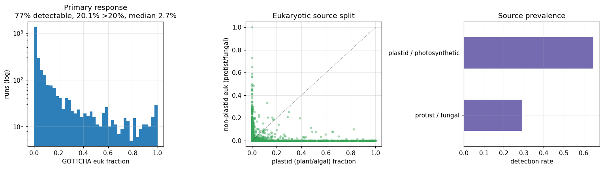
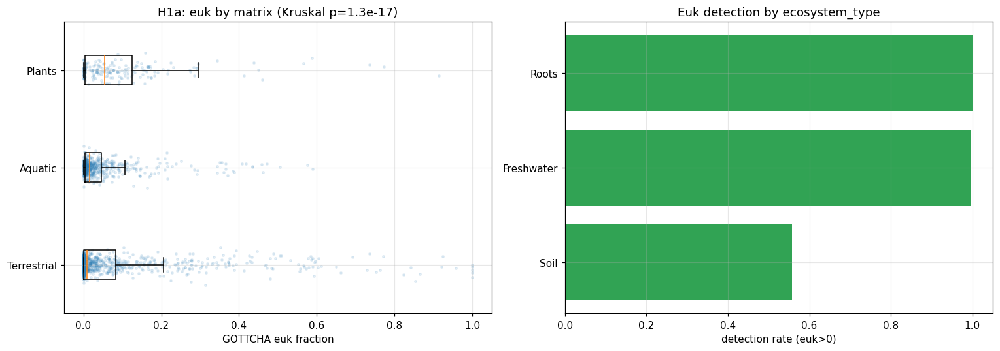
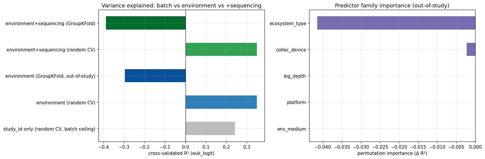
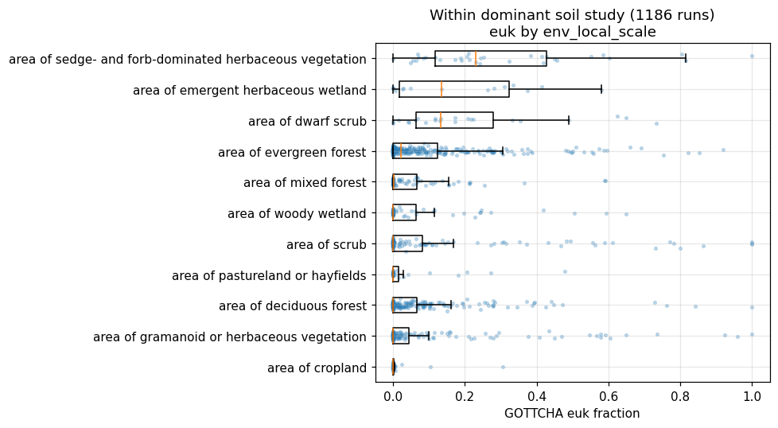

# Report: Metadata Correlates of Eukaryotic Contamination in NMDC Prokaryote-Targeted Metagenomes

## Key Findings

### 1. Eukaryotic contamination is common and overwhelmingly photosynthetic

Across **2,759 NMDC ReadbasedAnalysis runs** (native `nmdc.results` GOTTCHA2 classifications, 9 studies),
**77% carry detectable eukaryotic reads** (median eukaryotic fraction 2.7%, mean 13.3%; **20% of runs exceed 20% eukaryotic**). Among detectable runs, **plastid (plant/algal chloroplast) is a median 100% of the
eukaryotic signal** — eukaryotic contamination in these prokaryote-targeted metagenomes is dominated by
**photosynthetic** DNA, not animal-host DNA. The Kraken2 and Centrifuge domain-level Eukaryota signals are ≈0
because their NMDC reference databases are prokaryote-restricted (see Discoveries), so GOTTCHA2 is the only
usable estimator here; the near-absence of a Metazoan/host signal is therefore itself informative — host DNA
is not the dominant contaminant in this (largely environmental) collection.

*(Notebook: 01_data_assembly.ipynb)*

### 2. The eukaryotic *source* tracks environment biologically

The composition of the eukaryotic signal varies by sample matrix in a biologically coherent way
(`data/h1b_source_by_matrix.csv`):

| Matrix | Euk detection | Plastid share of euk | Dominant eukaryotic source |
|---|---|---|---|
| Aquatic (freshwater) | 99.5% | **1.00** | algal plastid (phytoplankton chloroplast) |
| Terrestrial (soil) | 55.7% | 0.43 | mixed plant plastid + soil fungi/protists |
| Plants (roots) | 100% | **0.03** | root-associated **fungi/protists** (non-plastid) |

Univariately, the eukaryotic fraction differs strongly across matrix (Kruskal–Wallis H=77.8, p=1.3×10⁻¹⁷);
all pairwise matrix contrasts are significant after BH-FDR (`data/h1a_pairwise_matrix.csv`). After excluding the
`Unknown`/missing-metadata bucket, `ecosystem_type` reduces to the same three biomes (Soil / Freshwater / Roots)
and the test is identical to the matrix test — it is not an independent confirmation. (An earlier version that
retained the `Unknown` bucket — which has the highest median eukaryotic fraction — reported an inflated
p≈10⁻⁵⁰; that was a missingness artifact and has been removed.)

*(Notebook: 02_univariate_tests.ipynb)*

### 3. The apparent "environment effect" does NOT generalize across studies — it is confounded with batch

This is the central methodological result. In NMDC, **each biome is ~80–100% nested within a single study**, so
the strong univariate environment signal cannot be separated from study/batch. A gradient-boosted model of the
eukaryotic fraction shows:

| Model | R² (euk_logit) |
|---|---|
| `study_id` only (random CV — batch ceiling) | 0.24 |
| environment (random CV) | 0.35 |
| **environment (GroupKFold, out-of-study)** | **−0.30** |
| environment + sequencing (GroupKFold) | −0.39 |

Environment explains **no more variance than `study_id` alone**, and when whole studies are held out the
environment model performs **worse than predicting the mean** (out-of-study detection AUC = 0.56 ≈ chance).
Adding sequencing metadata (platform, depth) does not help. **A naive cross-collection regression of eukaryotic
fraction on environmental metadata would therefore report a strong, but largely spurious (batch-driven),
association.**

A whole-collection (cross-study) depth association is present — Spearman ρ = −0.29, p=5.2×10⁻⁷ (n=292 runs with
measured depth): shallower samples carry more eukaryotic DNA, consistent with surface plant/algal input. This
statistic is **not** batch-controlled (measured-depth runs come from a handful of non-soil studies; the dominant
NEON soil study records no depth), so it is subject to the same study/batch confounding as the environment
effect above and should be read as suggestive only.

*(Notebook: 03_model_variance.ipynb)*

### 4. When batch is held constant (within one study), environment is genuinely predictive

Restricting to the single dominant study — a **NEON soil metagenome study** (1,186 runs, one sampling program,
constant protocol/batch) — the eukaryotic fraction varies strongly with the metadata that genuinely varies
*within* that study:

- **Local vegetation** (`env_local_scale`, 11 levels): Kruskal H=119.1, **p=7.6×10⁻²¹**. Highest in sedge/forb
  herbaceous soil (median 23%), emergent wetland (14%), dwarf scrub (13%), evergreen forest (2%); ≈0 in
  deciduous forest, cropland, pasture (`data/nb04_within_study_env_local.csv`).
- **Geography** (47 sites): Kruskal H=310.4, **p=2.4×10⁻⁴⁶**. Highest at **Arctic tundra** sites
  (Utqiaġvik 30%, Caribou-Poker Creeks 22%, Toolik 17%) versus temperate forests (2–8%).
- **Within-study predictability**: 5-fold R² = **+0.17 ± 0.06** (local environment + geography → euk fraction),
  in direct contrast to the cross-study out-of-study R² = −0.30.

Note: sampling depth is **not** measured in this NEON soil study (zero non-null `depth` values), so the depth
association reported below is a *cross-study* statistic and is not part of this batch-controlled result.

*(Notebook: 04_within_study.ipynb)*

## Discoveries

- **Cross-collection contamination-QC correlates are a confounding trap.** In NMDC, sample matrix/biome is
  ~80–100% nested within study, so the eukaryotic fraction's strong association with environment (p≈10⁻¹⁷ to
  10⁻⁵⁰) does not survive holding out whole studies (out-of-study R² = −0.30; = `study_id`-only R²). Any
  cross-collection "metadata correlate of contamination" analysis must control for study/batch (e.g., GroupKFold
  by study or within-study contrasts) or it will over-claim. This likely also qualifies biome-level correlates
  reported at scale elsewhere.
- **Within a batch-controlled study, environmental drivers of eukaryotic contamination are real and large:** in
  a NEON soil study, aboveground vegetation type and geography predict soil eukaryotic (plant/algal) read
  fraction (within-study R²=0.17; Arctic tundra ≫ temperate forest), i.e. eukaryotic contamination of soil
  metagenomes is set largely by aboveground photosynthetic input.
- **Eukaryotic contamination of environmental metagenomes is photosynthetic, not host-derived:** plastid is a
  median 100% of the GOTTCHA2 eukaryotic signal; source composition partitions by biome (algal plastid in
  freshwater, root fungi on plants, plant plastid in herbaceous soil).
- **NMDC read-based classifiers are not interchangeable for eukaryote quantification** — the Kraken2 and
  Centrifuge reference databases are prokaryote-restricted (domain-level Eukaryota ≈0; Kraken's only eukaryotic
  kingdom is Metazoa/human). Use GOTTCHA2 (plastid- and eukaryote-aware) to measure eukaryotic fraction.

## Performance Notes

- The read-based taxonomy tables are large (`kraken2_classification_report` ~29M rows). Aggregate each
  classifier to one row per `workflow_run_id` **before** joining to metadata; never scan them unfiltered.
- Analyse at the **`workflow_run_id`** level, not biosample level: NMDC pools many biosamples into one
  ReadbasedAnalysis run (1,067/2,759 runs are pooled), so biosample-level joins inflate n via pseudo-replication.
- The native `nmdc.results` tables are keyed by `data_object_id` / `workflow_run_id`; bridge to biosample/study
  via `nmdc.metadata.biosample_to_workflow_run` (join on `workflow_run_id`), then
  `biosample_set_associated_studies` (child tables key on `parent_id`). This links 99%+ of classified runs.

## Results

The response variable is the GOTTCHA2 relative eukaryotic abundance (Eukaryota + plastid) at superkingdom rank,
per ReadbasedAnalysis run. It is strongly zero-inflated (23% of runs have no detectable eukaryotic reads) with a
long upper tail (one run in five exceeds 20% eukaryotic). Because of this and the batch structure, all inference is non-parametric
(Kruskal–Wallis, Mann–Whitney with BH-FDR) or cross-validated (gradient boosting with GroupKFold by study).

| Test | Statistic | p | Interpretation |
|---|---|---|---|
| Euk ~ matrix (univariate) | H=77.8 | 1.3×10⁻¹⁷ | strong, but confounded (Finding 3) |
| Environment out-of-study R² | −0.30 | — | does **not** generalize across studies |
| Within-study euk ~ vegetation | H=119.1 | 7.6×10⁻²¹ | real when batch fixed |
| Within-study euk ~ geography | H=310.4 | 2.4×10⁻⁴⁶ | real when batch fixed |
| Within-study R² (env+geo) | +0.17 | — | genuine fine-scale environment effect |
| Euk ~ depth (cross-study, NOT batch-controlled) | ρ=−0.29 | 5.2×10⁻⁷ | shallower → more euk; confounded, suggestive only |

## Interpretation

Biologically, eukaryotic "contamination" of NMDC prokaryote-targeted metagenomes is largely **co-sampled
photosynthetic environmental DNA** — algal chloroplasts in freshwater, plant chloroplasts and soil fungi in
terrestrial samples, and root-associated fungi/protists in plant samples — rather than laboratory/animal-host
contamination. Its magnitude is set upstream at collection (what is physically in the sample and how much
microbial biomass dilutes it), consistent with the near-absence of any sequencing-platform or read-depth effect
once environment is considered.

Methodologically, the project's headline is a **cautionary result**: within a single public collection, the
eukaryotic fraction is so strongly structured by study/batch that a cross-study metadata-correlate analysis is
confounded and over-claims. The genuine environmental signal is only recoverable **within** a batch-controlled
study, where aboveground vegetation and geography clearly drive soil eukaryotic content (Arctic tundra and
herbaceous/wetland soils ≫ temperate forest/cropland).

### Literature Context

- **Finding 1–2 (matrix/biome as the primary correlate; photosynthetic dominance)** align with
  Eisenhofer, Alberdi & Woodcroft (2026, *mSystems*, PMID 41854267), who report biome-specific prokaryotic
  fraction across 136,284 metagenomes, and with Sobolev et al. (2025, *IJMS*, PMID 41373768), who show sample
  matrix (with extraction kit) drives eukaryotic admixture. The plastid/chloroplast dominance matches
  Chevokina et al. (2025, *Front Plant Sci*, PMID 41560914) and the plant-host-depletion literature
  (Wang et al. 2026, *Plant Biotechnol J*, PMID 41078118). Anthony et al. (2024, *Environ Microbiome*,
  PMID 39095861) likewise attribute poor soil metagenome resolution to plant/eukaryotic DNA.
- **Finding 3 (batch confounding)** extends and qualifies the SPF result: Eisenhofer et al.'s cross-collection
  correlate is essentially biome, and our data show that within NMDC such a biome correlate is inseparable from
  study/batch. This connects to Salter et al. (2014, *BMC Biology*, PMID 25387460) — biomass/batch as the master
  variable — and to Ortiz-Chura et al. (2024, *Anim Microbiome*, PMID 39456104), who quantify the metadata- and
  structure-limitations of public collections (>40% missing basic fields).
- **Finding 4 (within-study vegetation/geography effect)** aligns with GSC/metadata-rich soil studies such as
  Holm et al. (2025, *Environ Microbiome*, PMID 40708004), which link vegetation, land use and geography to soil
  microbial variation.

### Novel Contribution

To our knowledge this is the first attempt to regress a **measured eukaryotic read fraction against
collection/processing/sequencing metadata within a standardized public multi-omics collection (NMDC)**. The
literature gap (a metadata-field-resolved correlate analysis of eukaryotic fraction; `references.md`) is
genuine, and our result reframes it: the correlate analysis is **feasible only under batch control**. We
contribute (a) a reusable run-level eukaryotic-fraction pipeline over NMDC `nmdc.results`; (b) direct evidence
that cross-study environment correlates of contamination are batch-confounded; and (c) a batch-controlled
within-study estimate showing aboveground vegetation and geography genuinely drive soil eukaryotic content.

### Limitations

- **Few independent studies.** NMDC's read-based taxonomy spans only ~9 studies (one soil study ≈43% of runs);
  `data/01_data_landscape.md` documents that no on-system source provides per-sample eukaryotic read fraction
  across many studies (MGnify here is a MAG catalog; SPIRE/GEM/Tara are MAG collections; EMP is 16S). The
  cross-study generalization test is therefore under-powered, and the within-study result is demonstrated for
  **one soil study only** — it may not extend to aquatic or host-associated collections.
- **Wet-lab factors not testable.** NMDC does not populate DNA-extraction kit, size fractionation/filtration,
  host-depletion method, or library-prep fields (`data/00_feasibility_findings.md`); processing booleans in
  `biosample_to_workflow_run` are near-constant (`has_filtration` all false). The strongest literature levers
  (host depletion, extraction kit) thus remain the unmeasured residual.
- **Classifier/database dependence.** Only GOTTCHA2 yields a usable eukaryotic fraction; absolute values are
  database-dependent and should be read as relative/ordinal, not calibrated absolute contamination.
- **Confounding within study.** Even within one study, `env_local_scale` and geography may track sub-batches
  (sampling campaigns); the within-study effect is the best available control, not a randomized one.
- **Pooled-run metadata.** 1,067 of 2,759 runs are pooled from multiple biosamples; each pooled run inherits
  environment/collection metadata from a single representative biosample (`MIN(biosample_id)`). Where pooled
  biosamples differ in local metadata, this injects label noise into the predictors — a conservative bias
  (it can only weaken associations, not manufacture them).

## Data

### Sources
| Collection | Tables Used | Purpose |
|------------|-------------|---------|
| `nmdc_results` | `gottcha2_classification_report`, `kraken2_classification_report`, `centrifuge_output_report_file` | per-run read-based taxonomy → eukaryotic fraction |
| `nmdc_metadata` | `biosample_set`, `biosample_to_workflow_run`, `biosample_set_associated_studies`, `data_generation_set*`, `instrument_set` | environment/collection/sequencing predictors + study linkage |
| `kbase_nmdc_arkin` | `gottcha_gold`, `kraken_gold`, `centrifuge_gold`, `omics_files_table` | initial (v1) classifier snapshot + feasibility scan |

### Generated Data
| File | Rows | Description |
|------|------|-------------|
| `data/analysis_table.csv` | 2,759 | per-run euk fractions + predictors (raw) |
| `data/analysis_clean.csv` | 2,759 | cleaned modeling table |
| `data/h1a_pairwise_matrix.csv` | 3 | pairwise matrix contrasts (BH-FDR) |
| `data/h1a_ecosystem_type.csv` | 4 | euk fraction by ecosystem_type |
| `data/h1b_source_by_matrix.csv` | 3 | plastid vs protist/fungal by matrix |
| `data/variance_partition.csv` | 5 | R² by model (batch/env/seq × CV scheme) |
| `data/permutation_importance_family.csv` | 5 | predictor-family importance |
| `data/nb04_within_study_env_local.csv` | 11 | within-study euk by vegetation |
| `data/00_feasibility_findings.md` | — | predictor coverage feasibility |
| `data/01_data_landscape.md` | — | study-breadth scan across BERDL |

## Supporting Evidence

### Notebooks
| Notebook | Purpose |
|----------|---------|
| `01_data_assembly.ipynb` | build response variable + predictors from `nmdc.results`; distributions and source split |
| `02_univariate_tests.ipynb` | H1a (euk by environment) and H1b (source attribution); confound check |
| `03_model_variance.ipynb` | cross-study model, out-of-study GroupKFold, variance partition (Finding 3) |
| `04_within_study.ipynb` | batch-controlled within-study test on the NEON soil study (Finding 4) |

### Figures
| Figure | Description |
|--------|-------------|
| `fig01_euk_distributions.png` | eukaryotic-fraction distribution, source split, source prevalence |
| `fig02_euk_by_environment.png` | euk fraction by matrix (boxplots) and detection by ecosystem_type |
| `fig03_variance_partition.png` | R² by batch/environment/sequencing × random vs out-of-study CV; importance |
| `fig04_within_study_env.png` | within-study euk fraction by local vegetation (NEON soil) |

## Future Directions

1. **Break the batch confound with more studies.** Import a many-study raw-read resource (e.g. the SPF corpus,
   136K metagenomes / thousands of studies) or compute eukaryotic fraction across a broader collection, enabling
   a properly powered cross-study correlate analysis.
2. **Extend the within-study design** to the aquatic and plant-associated studies here, testing whether the
   vegetation/geography effect generalizes beyond soil and whether the algal-plastid vs root-fungal source split
   holds within batch-controlled cohorts.
3. **Acquire wet-lab metadata** (extraction kit, host-depletion method, size fraction) — either user-supplied
   per-study protocols or a collection that records them — to test the strongest literature levers that NMDC omits.
4. **Absolute calibration** of GOTTCHA2 eukaryotic fraction against a spike-in or SPF estimate to move from
   ordinal to calibrated contamination estimates.

## References
- Eisenhofer R, Alberdi A, Woodcroft BJ (2026). "Large-scale estimation of bacterial and archaeal DNA prevalence in metagenomes reveals biome-specific patterns." *mSystems*. PMID: 41854267.
- Salter SJ, Cox MJ, Turek EM, et al. (2014). "Reagent and laboratory contamination can critically impact sequence-based microbiome analyses." *BMC Biology*. PMID: 25387460.
- Sobolev A, Sibiryakina D, et al. (2025). "Benchmarking Cost-Effective DNA Extraction Kits for Diverse Metagenomic Samples." *Int J Mol Sci*. PMID: 41373768.
- Chevokina E, Sibiryakina D, et al. (2025). "Efficient recovery and DNA extraction for algae-associated microbial communities." *Front Plant Sci*. PMID: 41560914.
- Wang Y, Yang J, Hou H, et al. (2026). "Advancing Plant Microbiome Research Through Host DNA Depletion Techniques." *Plant Biotechnol J*. PMID: 41078118.
- Marotz CA, Sanders JG, Zuniga C, et al. (2018). "Improving saliva shotgun metagenomics by chemical host DNA depletion." *Microbiome*. PMID: 29482639.
- Nayfach S, Roux S, Seshadri R, et al. (2021). "A genomic catalog of Earth's microbiomes (GEM)." *Nat Biotechnol*. PMID: 33169036.
- Anthony WE, et al. (2024). "From soil to sequence: filling the critical gap in genome-resolved metagenomics." *Environ Microbiome*. PMID: 39095861.
- Holm JB, et al. (2025). "First island-wide, single-day soil collection study on Crete reveals environmental drivers of microbial diversity." *Environ Microbiome*. PMID: 40708004.
- Ortiz-Chura A, Popova M, Morgavi DP (2024). "Ruminant microbiome data are skewed and unFAIR." *Anim Microbiome*. PMID: 39456104.
- Hu B, Canon S, Eloe-Fadrosh EA, et al. (2021). "Challenges in Bioinformatics Workflows for Processing Microbiome Omics Data at Scale" (NMDC). *Front Bioinform*. PMID: 36303775.
- Thompson LR, et al. (2017). "A communal catalogue reveals Earth's multiscale microbial diversity" (EMP). *Nature*. DOI: 10.1038/nature24621.
- Sunagawa S, et al. (2015). "Structure and function of the global ocean microbiome" (Tara Oceans). *Science*. DOI: 10.1126/science.1261359.

*Full annotated reference list in `references.md`.*
