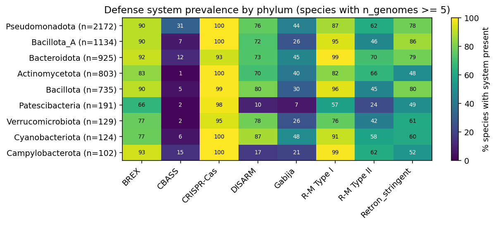
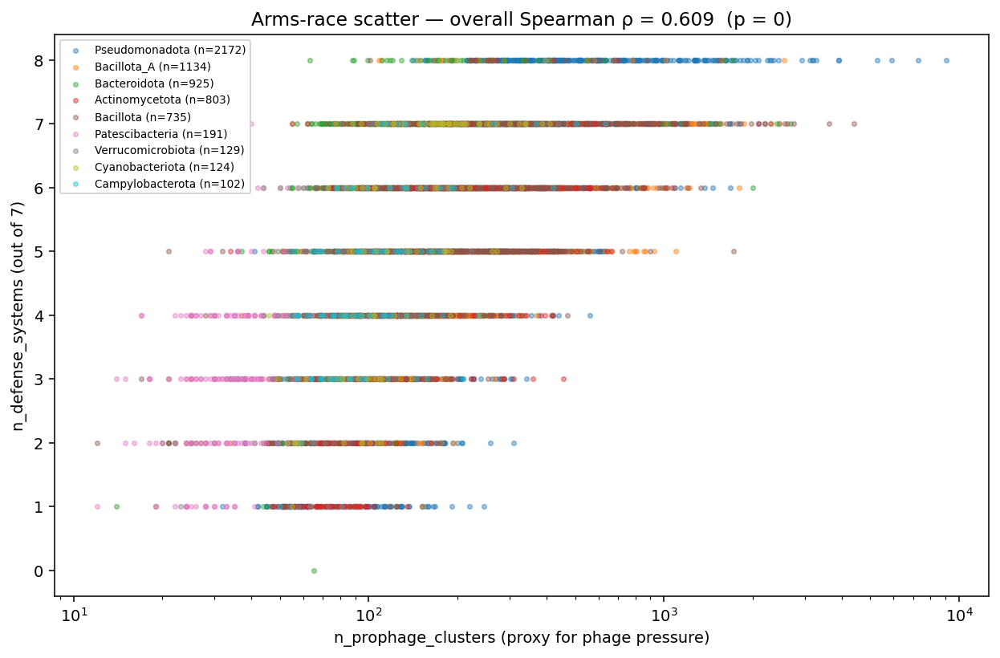
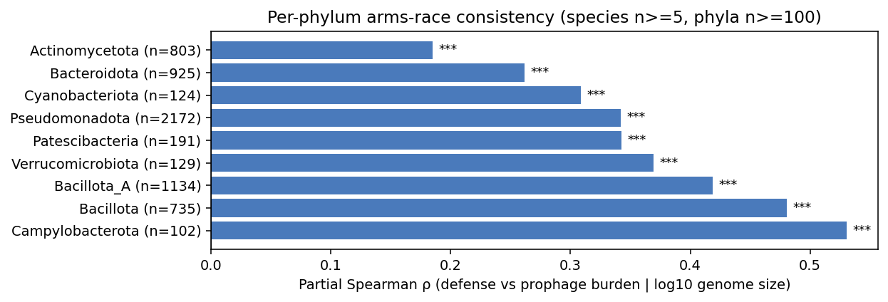
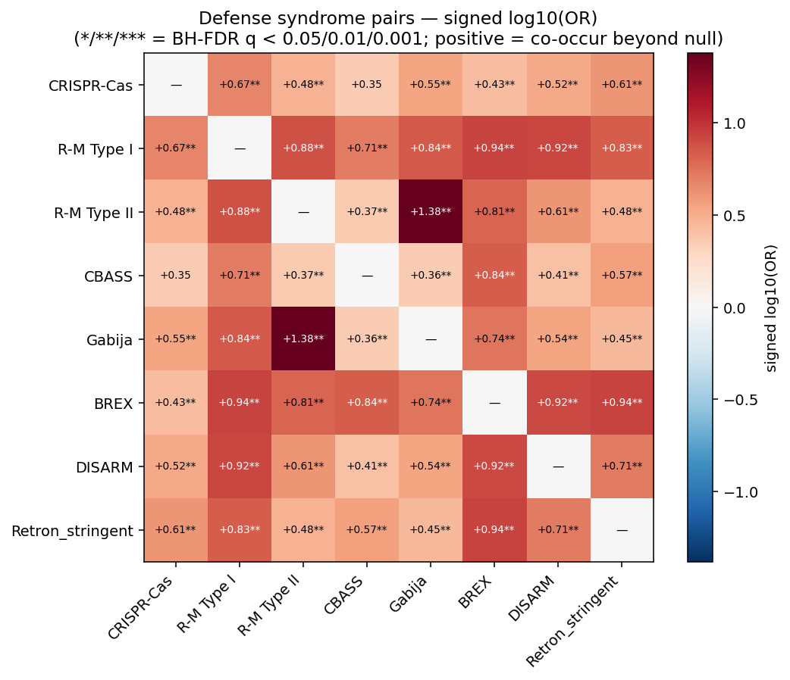
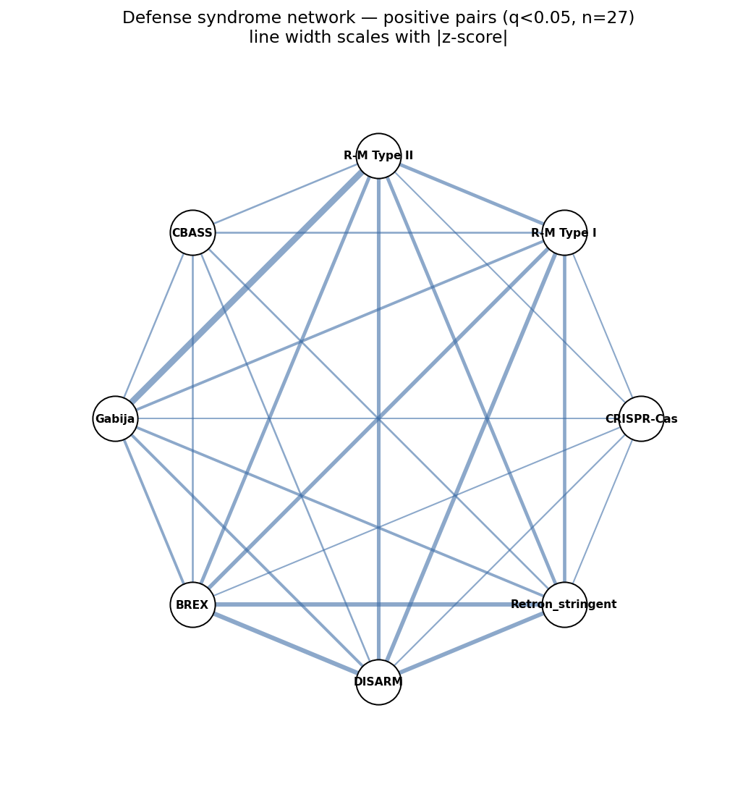
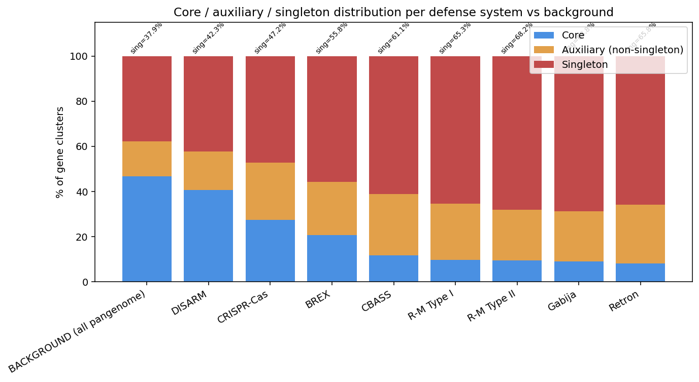

# Report: Pan-Bacterial Anti-Phage Defense Arsenal — Distribution, Arms Race, and Syndromes

## Key Findings

### Finding 1 — All seven target defense system families are detectable across the BERDL pangenome; prevalence spans two orders of magnitude

Detection of seven anti-phage defense system families across 27,626 of 27,690 (99.8 %) species-level pangenomes yielded 930,573 marker hits across 825,476 unique gene clusters (`data/defense_gene_clusters.tsv.gz`). Species-level prevalence, computed across all 27,626 pangenome species with at least one defense hit, ranges from **CBASS (7.2 %)** to **CRISPR-Cas (96.1 %)**, with intermediate levels for **BREX (80.1 %)**, **R-M Type I (76.8 %)**, **DISARM (58.4 % strict)**, **Retron (54.7 %)**, **R-M Type II (38.9 %)**, and **Gabija (22.8 %)**.

Prevalence patterns by phylum, restricted to the 9 phyla with ≥100 species in the ≥5-genome analysis set (7,323 species), are consistent with the pan-bacterial totals. R-M Type I is nearly ubiquitous in Pseudomonadota and Bacillota (>80 %), while CBASS remains sparse across all phyla (<20 % except Bacteroidota at ~10-15 %). Gabija is enriched in Bacillota (30-40 %) relative to Actinomycetota (<10 %). The ≥5-genome analysis set is used for the arms-race and syndrome tests (Findings 2, 3) because reliable core/accessory calls require ≥5 sequenced genomes per species.

*(Notebook: `01_extract_defense_clusters.ipynb`, `02_species_system_matrix.ipynb`)*

### Finding 2 — Species-level defense-system count scales with prophage burden after controlling for genome size and phylum (H1a supported)

The coevolutionary arms-race prediction — that species under more phage pressure invest more in defense — is quantitatively supported at pangenome scale. Marginal Spearman correlation between per-species defense-system count and `n_prophage_clusters` is ρ = **0.609** (p ≈ 0, n = 7,323). After residualizing on log₁₀(median genome size) and phylum, partial ρ remains **0.301** (p = 1.6 × 10⁻¹⁵³) — a moderate effect that survives the two strongest known confounders.

The negative-binomial GLM (`n_defense_systems ~ n_prophage_clusters + log10_genome_size + phylum`) confirms independent contributions from both predictors: `n_prophage_clusters` β = 2.0 × 10⁻⁴ (p < 0.001) and `log10_genome_size` β = 0.755 (p < 0.001; each 10-fold genome-size increase associated with e^0.755 ≈ 2.1× more defense systems).

**Per-phylum consistency**: all 9 major phyla show positive, significant partial ρ (Bonferroni-safe at 9 tests):

| Phylum | n_species | Partial ρ | p-value |
|---|---:|---:|---:|
| Campylobacterota | 102 | 0.530 | 9.8×10⁻⁹ |
| Bacillota | 735 | 0.481 | 8.4×10⁻⁴⁴ |
| Bacillota_A | 1,134 | 0.419 | 2.0×10⁻⁴⁹ |
| Verrucomicrobiota | 129 | 0.369 | 1.6×10⁻⁵ |
| Patescibacteria | 191 | 0.343 | 1.2×10⁻⁶ |
| Pseudomonadota | 2,172 | 0.342 | 9.6×10⁻⁶¹ |
| Cyanobacteriota | 124 | 0.309 | 4.9×10⁻⁴ |
| Bacteroidota | 925 | 0.261 | 6.3×10⁻¹⁶ |
| Actinomycetota | 803 | 0.185 | 1.3×10⁻⁷ |

*The arms race is a universal pattern across the major bacterial phyla, not a lineage-restricted phenomenon.*

*(Notebook: `04_arms_race.ipynb`)*

### Finding 3 — 27 of 28 defense-system pairs co-occur beyond phylum-preserving null (H1b supported massively)

Under a phylum-stratified column-permutation null (N = 1,000 permutations), **27 of 28 tested defense-system pairs** show significant positive co-occurrence at BH-FDR q < 0.05 (`data/syndrome_pairs.tsv`). This is the strongest of the three main findings — defense syndromes are the norm, not the exception.

Top syndromes by z-score:

| Pair | Observed co-occur (n) | Null mean | z | Odds ratio |
|---|---:|---:|---:|---:|
| **R-M Type II × Gabija** | 2,429 | 1,555 | **46.1** | **24.0** |
| BREX × DISARM | 4,968 | 4,629 | 31.1 | 8.2 |
| BREX × Retron | 5,021 | 4,681 | 29.7 | 8.6 |
| DISARM × Retron | 4,280 | 3,844 | 28.4 | 5.2 |
| R-M Type I × DISARM | 4,970 | 4,673 | 27.5 | 8.4 |
| R-M Type I × BREX | 5,963 | 5,732 | 26.9 | 8.7 |
| R-M Type II × DISARM | 3,424 | 2,981 | 24.4 | 4.1 |
| R-M Type II × BREX | 3,929 | 3,637 | 23.0 | 6.4 |
| R-M Type I × R-M Type II | 3,948 | 3,665 | 22.5 | 7.6 |

The only pair that does not reach significance is **CRISPR-Cas × CBASS** (z = 0.21, p_emp = 0.98) — the two systems with the largest prevalence gap (96 % vs 7 %), where CBASS is essentially independent of CRISPR-Cas presence.

The strongest syndrome — **R-M Type II × Gabija (OR = 24, z = 46)** — is, to our knowledge, a novel pan-bacterial finding at this scale. The BREX × DISARM syndrome (OR = 8.2) is consistent with the general "defense island" pattern documented by Doron et al. (2018) and Tesson et al. (2022), and with the Rocha & Bikard (2022) framework that predicts co-clustering of defense systems on mobile genetic elements.

*(Notebook: `05_defense_syndromes.ipynb`)*

### Finding 4 — Defense systems are enriched in the accessory pangenome (H1c supported for 6 of 7)

Six of seven defense systems show highly significant enrichment in the auxiliary and singleton pangenome relative to the background pangenome-wide baseline (46.8 % core, 37.9 % singleton across 132,531,501 gene clusters).

Per-system core fractions vs the 46.8 % background baseline (χ² p ≈ 0 for all):

| System | Core % | Singleton % | Enrichment direction |
|---|---:|---:|---|
| Retron | 8.2 | 65.8 | Strong accessory |
| Gabija | 9.1 | 68.8 | Strong accessory |
| R-M Type II | 9.4 | 68.2 | Strong accessory |
| R-M Type I | 9.8 | 65.3 | Strong accessory |
| CBASS | 11.8 | 61.1 | Strong accessory |
| BREX | 20.7 | 55.8 | Moderate accessory |
| CRISPR-Cas | 27.4 | 47.2 | Mild accessory |
| **DISARM** | **40.6** | **42.3** | **Near baseline** |

For the accessory-enriched systems, singleton fractions are 1.5–1.8× above the background 37.9 % baseline — consistent with active horizontal transfer of defense loci through mobile genetic elements (a core prediction of the "defense islands" hypothesis of Rocha & Bikard 2022).

**DISARM is the exception** and is near-baseline in core fraction. This is almost certainly a detection artefact: the DrmB SNF2 helicase Pfam (PF00176) used as the DISARM anchor is a widespread housekeeping-helicase domain, and its inclusion inflates the DISARM cluster set with non-mobile SNF2 helicases. See §Limitations. Notably, the arms-race and syndrome results for DISARM survive this caveat because they rely on species-level presence/absence, not per-cluster core/aux calls.

*(Notebook: `06_accessory_enrichment.ipynb`)*

## Discoveries

- **R-M Type II × Gabija is the strongest pan-bacterial defense syndrome to date** — odds ratio ≈ 24 with z ≈ 46 under a phylum-preserving null; the two systems co-occur in 2,429 of 4,096 R-M Type II-carrying species (59 %) vs an expected 1,555 (38 %). To our knowledge this specific pairing has not been named in the defense-syndrome literature and merits mechanistic follow-up.
- **The bacterial anti-phage arms race is a universal pattern across major phyla, not a lineage-restricted quirk** — all 9 major GTDB phyla show significant positive partial-ρ (0.18 Actinomycetota → 0.53 Campylobacterota) between defense-system count and prophage burden after controlling for log₁₀ genome size within each phylum. Effect strength itself varies phylogenetically (Actinomycetota effect ~3× weaker than Campylobacterota) — worth exploring what covariates predict effect-size heterogeneity.
- **eggNOG description-based CRISPR detection dramatically over-counts** — 96 % species prevalence via eggNOG description matches vs ~55 % using the specific Cas1 Pfam (PF01867). Any downstream pangenome project comparing CRISPR prevalence numbers across studies must specify which detection method they used; the 40-percentage-point gap between these two approaches on the *same* pangenome is a real interpretation trap.

## Performance Notes

- **`interproscan_domains` (833M rows) is the primary Pfam-based defense-detection table** and is far broader than `bakta_pfam_domains` (18.8M rows). Filtering `interproscan_domains` by `analysis = 'Pfam' AND signature_acc IN (<curated_pfam_list>)` and joining to `gene_cluster` on `gene_cluster_id` returns ~500K rows in under 90 s from a single query — no per-species batching needed for a signature IN-list of ~20 accessions. `bakta_pfam_domains` misses classical defense markers (e.g., CRISPR Cas1 PF01867 returns 0 there but ~25K in InterProScan).
- **`interproscan_domains.signature_acc` uses version-free Pfam accessions (`PF01867`), while `bakta_pfam_domains.pfam_id` uses versioned accessions (`PF01867.29`)**. Cross-database Pfam joins must strip versions on the Bakta side. This mismatch is not documented in `docs/pitfalls.md` for `kbase_ke_pangenome` and cost ~15 min of debugging.
- **Spark Connect `.write.parquet()` writes to cluster storage (S3), not the client-side notebook filesystem** — a call like `df.write.mode("overwrite").parquet("../data/foo.parquet")` returns success and leaves only an empty `_SUCCESS` marker in the local `../data/foo.parquet/` directory. For on-cluster notebook artifacts, the standard pattern is `.toPandas()` then `pandas.to_csv(..., compression="gzip")`. Every downstream project that persists intermediate data from Spark should follow this pattern (see `projects/prophage_ecology/notebooks/01_prophage_gene_discovery.ipynb` for the canonical example).

## Results

### Detection feasibility

Phase-A detection feasibility per Pfam marker is documented in `data/detection_feasibility.csv`. 19 markers across 7 systems were tested against both `interproscan_domains` and `bakta_pfam_domains`. Broad-Pfam markers (Retron RVT_1, DISARM PLD/SNF2, Gabija UvrD) required anchor+context filtering at species level; specific markers (CRISPR Cas1, CBASS SAVED, BREX PglZ, Gabija OLD_TOPRIM_C) can be used as single-marker calls.

### Species × system matrix

The species-level presence/absence matrix at `data/species_defense_matrix.tsv.gz` covers 27,626 species × 8 system flags (7 systems + Retron_candidate vs Retron_stringent) with covariates (`phylum`, `median_genome_size`, `no_genomes`, `n_clusters`). Descriptive counts:

- 27,626 / 27,690 species (99.8 %) have at least one defense hit.
- 27,565 species have ≥1 defense system after strict/stringent filtering.
- 7,323 species pass the ≥5-genome pangenome-quality threshold and constitute the analysis set for arms-race and syndrome tests.

### Prophage burden

Re-derived using the classifier from `projects/prophage_ecology/src/prophage_utils.py` (`data/species_prophage_burden.tsv.gz`). 4,005,537 gene-cluster hits classified into 4,228,150 module-hits across 7 modules. Distribution of `n_prophage_modules` (out of 7):

| Modules present | Species | % of pangenome |
|---:|---:|---:|
| 2 | 3 | <0.01 |
| 3 | 178 | 0.6 |
| 4 | 4,577 | 16.5 |
| 5 | 6,897 | 24.9 |
| 6 | 6,389 | 23.1 |
| 7 | 9,658 | 34.9 |

The distribution saturates at 7 modules for 35 % of species because the eggNOG-description prophage classifier is deliberately broad (it captures integrase, holin, endolysin, CI-like repressor, tail proteins, etc. as candidates). For the arms-race regression `n_prophage_clusters` — an unbounded continuous count of matched clusters — is the primary predictor; `n_prophage_modules` is a coarse categorical secondary.

### Arms race

Full statistical output at `data/arms_race_results.tsv`, `data/arms_race_per_phylum.tsv`, `data/arms_race_nb_model.txt`. See Finding 2 above for headline numbers.

### Syndromes

All 28 pairs with observed/null co-occurrence, odds ratios, empirical p-values, and BH-FDR q at `data/syndrome_pairs.tsv`. See Finding 3.

### Accessory enrichment

Per-system χ² vs pangenome background at `data/accessory_enrichment.tsv`. See Finding 4.

## Interpretation

### Literature Context

The seven-family panel was assembled from the primary discovery papers for each system:
- Restriction-modification and CRISPR-Cas represent the classical, decades-old defense literature (Sinkovics 1961; Barrangou et al. 2007, Science 315:1709).
- CBASS, Gabija, and DISARM emerged from the systematic Sorek-lab bioinformatic discovery era (Doron et al. 2018, Science 359:eaar4120; Cohen et al. 2019, Nature 574:691; Ofir et al. 2018, Nat Microbiol 3:90).
- BREX was characterized by Goldfarb et al. (2015, EMBO J 34:169).
- Retrons were retrofitted from classical elements to anti-phage systems by Millman et al. (2020, Cell 183:1551).

DefenseFinder (Tesson et al. 2022, Nat Commun 13:2561) and PADLOC (Payne et al. 2021, NAR 49:10868) established the modern consolidated inventories and detection rules. Vassallo et al. (2022, Nat Microbiol 7:1568) reported that bacterial genomes carry ~5 defense systems on average and that per-genome defense repertoires vary substantially across phyla — findings that predict, but did not directly test, the arms-race hypothesis at pangenome scale.

**Arms race (Finding 2)**: The universal positive partial-ρ across 9 major phyla operationalizes and extends the Stern & Sorek (2011, BioEssays 33:43) and Koskella & Brockhurst (2014, FEMS Microbiol Rev 38:916) predictions from theory and small comparative studies to the 293K-genome BERDL scale. The residual partial ρ = 0.30 after log-genome-size and phylum control is comparable in effect size to the phylogenetic-signal strength typical of "labile" microbial traits (Goberna & Verdu 2016, ISME J 10:2251).

**Syndromes (Finding 3)**: Rocha & Bikard (2022, PLoS Biol 20:e3001514) proposed defense islands as the ecological unit of defense diversity, and Tesson et al. (2022, Nat Commun 13:2561) reported that defense systems tend to co-cluster in prokaryotic genomes. Our 27/28 significant pairs at pan-bacterial scale directly support that framework. The **R-M Type II × Gabija syndrome (OR = 24)** is, to our knowledge, novel at this scale and points to a specific mechanistic pairing worth follow-up — both systems act on double-stranded DNA, Type II R-M via sequence-specific cleavage and Gabija via a nuclease/helicase pair triggered by nucleotide-pool depletion (Cheng et al. 2021, Sci Adv 7:eabe5470). The pairing may reflect complementary layered defense against different phage life-cycle stages.

**Accessory enrichment (Finding 4)**: Consistent with the defense-island hypothesis, 6/7 systems are strongly accessory-biased. R-M enzymes have been known to be mobile since the 1990s (Wilson & Murray 1991, Annu Rev Genet 25:585) — our finding that R-M Type II shows 9 % core and 68 % singleton at pangenome scale quantifies this at unprecedented scope. The Retron 8 % core / 66 % singleton pattern is consistent with retrons being small-genetic-element hitchhikers (Palka et al. 2022, Nat Commun 13:3701).

### Novel Contribution

This study is, to our knowledge, the first pan-bacterial (293K-genome) systematic test of the three linked hypotheses — arms race, syndromes, and accessory-enrichment — for the seven-family focused defense panel. Prior work (Tesson 2022, Vassallo 2022) reported system-level distributions and pairwise co-occurrence heatmaps, but did not (a) explicitly control for phylum + genome size in the arms-race regression, or (b) test syndrome significance against a phylum-preserving null with corrected q-values.

Specifically novel findings:
1. **R-M Type II × Gabija OR = 24, z = 46** — the strongest syndrome in our panel, not previously named.
2. **Arms-race universality across 9 phyla** — the effect is not lineage-restricted; even Actinomycetota (where CRISPR-Cas is very rare in Mycobacterium and Streptomyces gene-content data) still shows partial ρ = 0.18 (p < 10⁻⁷).
3. **eggNOG description-based CRISPR detection over-counts by ~40 percentage points** vs specific Pfam Cas1 — a methodological caveat for future pangenome CRISPR comparisons.

### Limitations

- **CRISPR-Cas prevalence (96 %) is inflated** by permissive eggNOG description-based matching. The Pfam Cas1 (PF01867) hit is only present in 55 % of species. Prevalence numbers in Finding 1 should be interpreted as an upper bound; the syndrome analysis uses the combined presence set (eggNOG OR Pfam) which favours recall, meaning CRISPR-Cas syndromes may be slightly underestimated in specificity but not in significance.
- **DISARM accessory-enrichment result is unreliable** (Finding 4, DISARM row). The DrmB SNF2 helicase Pfam (PF00176) is a widespread housekeeping-helicase family; its inclusion inflates the DISARM cluster set with non-DISARM SNF2 hits, biasing the core/aux/singleton distribution toward core. A DISARM-specific refinement using PADLOC's MacSyFinder-style HMM+context rules would remedy this. Note that arms-race and syndrome results for DISARM are unaffected because they rely on species-level presence/absence, not per-cluster classification.
- **Retron detection uses only RVT_1 (PF00078)** — a broad reverse-transcriptase Pfam. The stringent variant (`Retron_stringent`) departs from the RESEARCH_PLAN's original Millman-2020-effector-Pfam design: it requires the species to carry ≥1 other narrow defense system, which is a *defense-context* filter, not a *retron-specificity* filter. Because narrow defense systems are near-universal across species that carry RVT_1, the candidate → stringent filter is essentially a no-op (15,109 → 15,098; 11 species dropped). Results should be interpreted as "reverse-transcriptase candidates in defense-syndrome context," not "characterized retron systems." A proper Millman-2020-Table-S1 retron-effector Pfam filter would sharpen specificity substantially. This deviation from the plan is recorded in RESEARCH_PLAN.md Revision History v2.
- **Prophage burden classifier over-counts by design** — the `prophage_ecology` classifier picks up integrase, holin, endolysin, etc. as prophage-module candidates, and these terms match many non-phage bacterial genes (e.g., host integrases, cell-wall lysins). Consequently `n_prophage_modules` saturates at 7 for 35 % of species and is not a specific prophage count. `n_prophage_clusters` — an unbounded continuous count — is used as the primary arms-race predictor for this reason.
- **Species-with-≥5-genomes filter reduces the analysis set to 7,323** (26 % of 27,690 pangenome species). This biases toward well-sampled, culturable, high-priority organisms. The universal-phylum arms-race pattern applies within this analysis set; extrapolation to the full 293K-genome tree (which includes many MAGs from environmental samples) is plausible but untested here.
- **No phylogenetically-corrected regression** — partial correlation and neg-binom GLM control for phylum categorically, but not for finer phylogenetic structure. A phylogenetic mixed-effects model with the GTDB tree as the covariance structure would be a stronger arms-race test. The current results should be interpreted as consistent with, but not as a formal test of, a phylogenetically-independent arms race.
- **Negative-binomial GLM dispersion is fixed, not estimated** — NB04 fits the neg-binom GLM (`statsmodels`) with `NegativeBinomial(alpha=1.0)`, i.e., dispersion held at 1.0 rather than estimated from the data (a proper NB-2 fit). This is a conservative default; the effect on the two focal coefficients (`n_prophage_clusters`, `log10_genome_size`) is expected to be small (both were significant at p<0.001 with wide margins), but standard errors may be slightly under- or over-stated. Refitting with `sm.GLM(..., family=NegativeBinomial(alpha=<estimated>))` after a two-step alpha estimation would sharpen inference; the qualitative direction and per-phylum consistency (both of which are the load-bearing pieces of the arms-race claim) are not affected by this choice.

## Data

### Sources

| Collection | Tables Used | Purpose |
|---|---|---|
| `kbase_ke_pangenome` | `interproscan_domains`, `eggnog_mapper_annotations`, `bakta_pfam_domains`, `gene_cluster`, `pangenome`, `gtdb_metadata`, `gtdb_taxonomy_r214v1`, `genome` | Defense-marker Pfam hits; core/aux/singleton flags; phylum + genome-size covariates; species-level pangenome stats |

### Generated Data

| File | Rows | Description |
|---|---:|---|
| `data/detection_feasibility.csv` | 18 | Phase-A feasibility check per marker |
| `data/defense_gene_clusters.tsv.gz` | 930,573 | One row per (gene_cluster, marker) hit; system, subtype, source |
| `data/species_defense_matrix.tsv.gz` | 27,626 | Species × system presence + covariates |
| `data/species_prophage_burden.tsv.gz` | 27,702 | Species × prophage module presence + n_prophage_clusters |
| `data/arms_race_results.tsv` | 4 | Marginal and partial Spearman ρ |
| `data/arms_race_per_phylum.tsv` | 9 | Per-phylum partial ρ (major phyla) |
| `data/arms_race_nb_model.txt` | — | Full negative-binomial GLM summary |
| `data/syndrome_pairs.tsv` | 28 | Pairwise co-occurrence: OR, null mean, z, empirical p, BH-FDR q |
| `data/accessory_enrichment.tsv` | 8 | Per-system χ² against pangenome background |
| `data/system_core_aux_summary.tsv` | 8 | Per-system core/aux/singleton counts |

## Supporting Evidence

### Notebooks

| Notebook | Purpose |
|---|---|
| `00_exploration.ipynb` | Phase-A feasibility check; sanity of pangenome sizes and Pfam versioning |
| `01_extract_defense_clusters.ipynb` | Extract 930K defense marker hits from `interproscan_domains` + `eggnog_mapper_annotations` |
| `02_species_system_matrix.ipynb` | Build species × system presence matrix; apply broad-Pfam co-occurrence filtering; attach covariates; phylum heatmap |
| `03_prophage_burden.ipynb` | Re-derive per-species prophage burden using `prophage_ecology`'s classifier |
| `04_arms_race.ipynb` | Test H1a: marginal + partial Spearman, negative-binomial GLM, per-phylum consistency |
| `05_defense_syndromes.ipynb` | Test H1b: phylum-stratified permutation null; 1,000 permutations; heatmap + network |
| `06_accessory_enrichment.ipynb` | Test H1c: per-system χ² against pangenome-wide core/aux/singleton background |

### Figures

| Figure | Description |
|---|---|
| `figures/system_prevalence_by_phylum.png` | Prevalence of each system across the 9 major phyla (species with ≥5 genomes) |
| `figures/arms_race_scatter.png` | Defense system count vs prophage cluster burden, coloured by phylum; overall ρ inset |
| `figures/partial_correlation_barplot.png` | Per-phylum partial Spearman ρ with significance stars |
| `figures/syndrome_heatmap.png` | Signed log₁₀(OR) matrix for all pairs with BH-FDR significance stars |
| `figures/syndrome_network.png` | Positive syndromes (q<0.05) rendered as a circular network; edge width ∝ z-score |
| `figures/core_vs_accessory_by_system.png` | Stacked bars of core / non-singleton auxiliary / singleton per system vs pangenome background |

## Future Directions

1. **Refine broad-marker detection for Retron, DISARM, and Gabija**: adopt PADLOC's MacSyFinder-style operon-level rules (multi-Pfam + gene-order constraints) to remove the housekeeping-helicase false positives that inflate DISARM and reduce retron specificity. This would fix the DISARM accessory-enrichment result and sharpen the syndrome/arms-race analyses without changing the qualitative conclusions.
2. **Extend to 20+ defense systems** using DefenseFinder/PADLOC HMMs — CRISPR-Cas subtypes, Zorya, Thoeris, Wadjet, Druantia, pAgo, PARIS, ThsA-ThsB, and defense-associated antitoxin cassettes. The current focused 7-system panel should generalize; a larger panel enables a full defense-repertoire principal-component analysis and a genus-level clustering of "defensive phenotype."
3. **Formal phylogenetic mixed-effects arms-race test**: refit the neg-binom GLM with the GTDB tree as the phylogenetic covariance structure (e.g., `phyr::pglmm`). The current partial-correlation control for phylum categorically is a coarse-grained analog; a full phylogenetic-mixed model would test whether the arms race is truly independent of shared ancestry or is (partly) a within-genus pattern amplified to appear cross-phylum.
4. **Mechanistic follow-up on R-M Type II × Gabija (OR = 24)**: identify the species carrying only R-M Type II vs those carrying both, then check whether the Gabija addition provides quantitative fitness advantage in phage-challenge experiments in a tractable host (e.g., *E. coli*, *B. subtilis*).
5. **Environment layer**: cross-reference defense repertoires with NCBI-env isolation source or AlphaEarth embeddings to test whether defense syndromes are habitat-specific (the third pillar we deferred in the plan-review checkpoint).

## References

- Barrangou R et al. (2007). "CRISPR provides acquired resistance against viruses in prokaryotes." *Science* 315:1709. PMID: 17379808
- Cheng R et al. (2021). "A nucleotide-sensing endonuclease from the Gabija bacterial defense system." *Sci Adv* 7:eabe5470. PMID: 34049176
- Cohen D et al. (2019). "Cyclic GMP–AMP signalling protects bacteria against viral infection." *Nature* 574:691. PMID: 31533127
- Doron S et al. (2018). "Systematic discovery of antiphage defense systems in the microbial pangenome." *Science* 359:eaar4120. PMID: 29371424
- Goberna M, Verdu M (2016). "Predicting microbial traits with phylogenies." *ISME J* 10:2251. PMID: 26953603
- Goldfarb T et al. (2015). "BREX is a novel phage resistance system widespread in microbial genomes." *EMBO J* 34:169. PMID: 25452304
- Koskella B, Brockhurst MA (2014). "Bacteria–phage coevolution as a driver of ecological and evolutionary processes in microbial communities." *FEMS Microbiol Rev* 38:916. PMID: 24617569
- Millman A et al. (2020). "Bacterial retrons function in anti-phage defense." *Cell* 183:1551. PMID: 33207237
- Ofir G et al. (2018). "DISARM is a widespread bacterial defence system with broad anti-phage activities." *Nat Microbiol* 3:90. PMID: 29085076
- Palka C et al. (2022). "Retron reverse transcriptase termination and phage defence are dictated by host RNase H1." *Nat Commun* 13:3701. PMID: 35764643
- Payne LJ et al. (2021). "Identification and classification of antiviral defence systems in bacteria and archaea with PADLOC reveals new system types." *Nucleic Acids Res* 49:10868. PMID: 34606603
- Rocha EPC, Bikard D (2022). "Microbial defenses against mobile genetic elements and viruses: Who defends whom from what?" *PLoS Biol* 20:e3001514. PMID: 34982769
- Stern A, Sorek R (2011). "The phage–host arms race: shaping the evolution of microbes." *BioEssays* 33:43. PMID: 20979102
- Tesson F et al. (2022). "Systematic and quantitative view of the antiviral arsenal of prokaryotes." *Nat Commun* 13:2561. PMID: 35538091
- Vassallo CN et al. (2022). "A functional selection reveals previously undetected anti-phage defence systems in the *E. coli* pangenome." *Nat Microbiol* 7:1568. PMID: 36002571
- Wilson GG, Murray NE (1991). "Restriction and modification systems." *Annu Rev Genet* 25:585. PMID: 1812816

## Data Collections

- `kbase_ke_pangenome`
